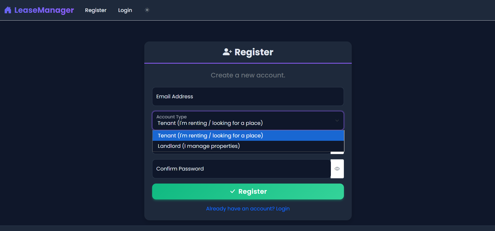
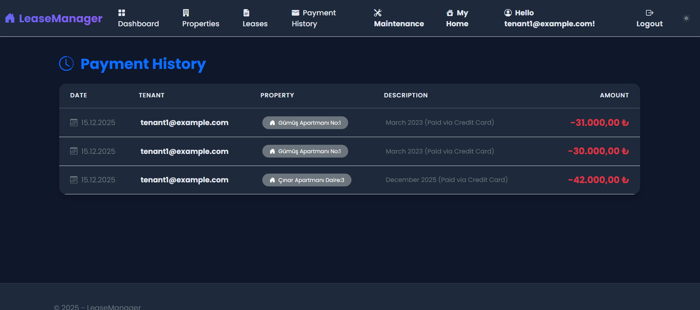
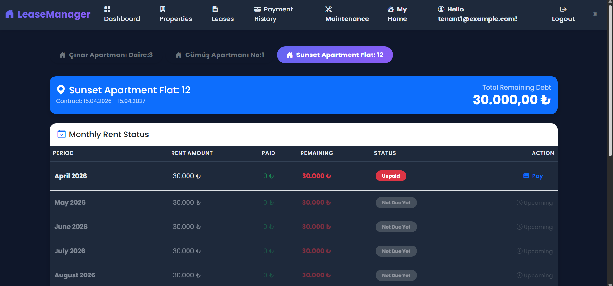
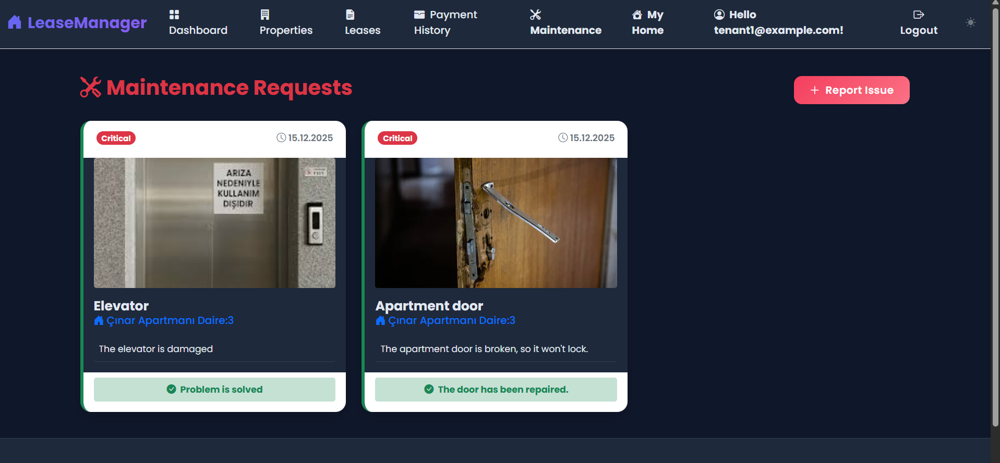
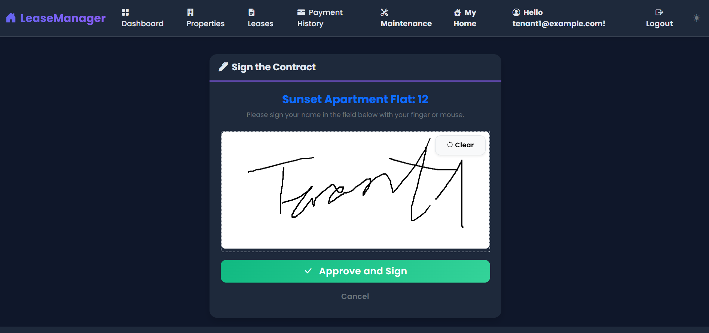
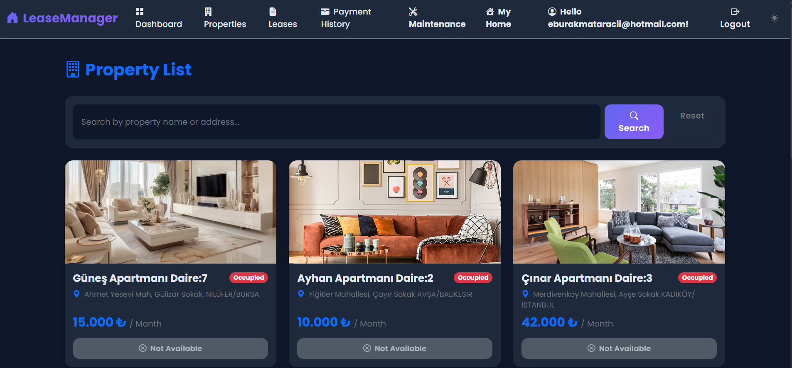

RealEstateLease (Lease Manager)
A comprehensive ASP.NET-based web application designed to digitize property leasing processes, featuring secure digital e-signatures, automated financial tracking, and an analytical dashboard for property owners.

✨ Features
Digital E-Signatures: Legally compliant digital signing module for lease agreements to eliminate paperwork.

Automated Billing: Automated invoice generation and tracking for monthly rent payments.

Owner Dashboard: High-level analytics for property owners to monitor income, occupancy rates, and expense reports.

Property Management: Full CRUD operations for managing multiple property types and units.

User Authentication: Role-based access control (Admin, Owner, Tenant) with secure session management.

Reporting: Exportable financial reports and payment history.

🧱 Tech Stack
Backend: .NET 6/8 (ASP.NET Core MVC / Web API), C#

ORM: Entity Framework Core

DB: Microsoft SQL Server (MS SQL)

Frontend: HTML5, CSS3, JavaScript, Bootstrap / Tailwind CSS

Tools: Intel VTune Profiler (for performance optimization), Git

Architecture: Repository Pattern & N-Tier Architecture (optional - if you used it)

📂 Project Structure
RealEstateLease/
├─ RealEstate.Web/              # Presentation Layer (MVC Controllers & Views)
│  ├─ Controllers/
│  ├─ Views/
│  └─ wwwroot/                  # Static files (CSS, JS, Images)
├─ RealEstate.Business/         # Logic Layer (Services & Validations)
├─ RealEstate.Data/             # Data Access Layer (DbContext & Migrations)
│  ├─ Context/
│  └─ Repositories/
├─ RealEstate.Entity/           # Core Entities (Models)
│  ├─ Concrete/
│  └─ DTOs/
├─ appsettings.json             # Database & Secret configurations
└─ RealEstateLease.sln          # Visual Studio Solution
🔧 Configuration
1) Connection String
Update the connection string in appsettings.json to point to your local or remote MS SQL Server instance:

JSON
{
  "ConnectionStrings": {
    "DefaultConnection": "Server=YOUR_SERVER;Database=RealEstateDb;Trusted_Connection=True;TrustServerCertificate=True;"
  }
}
2) Digital Signature API (Optional)
If using an external service for e-signatures, configure your API keys in environment variables:

Bash
export ESIGN_API_KEY="your_api_key_here"
3) Database Schema
The application uses Entity Framework Migrations. To initialize the database, run:

PowerShell
Update-Database
Minimal SQL Schema Overview:

SQL
CREATE TABLE Users (
    Id INT PRIMARY KEY IDENTITY,
    FullName NVARCHAR(100),
    Email NVARCHAR(256) UNIQUE,
    PasswordHash VARBINARY(MAX)
);

CREATE TABLE Properties (
    Id INT PRIMARY KEY IDENTITY,
    Title NVARCHAR(200),
    Address NVARCHAR(MAX),
    OwnerId INT FOREIGN KEY REFERENCES Users(Id)
);

CREATE TABLE Leases (
    Id INT PRIMARY KEY IDENTITY,
    PropertyId INT FOREIGN KEY REFERENCES Properties(Id),
    TenantId INT FOREIGN KEY REFERENCES Users(Id),
    StartDate DATETIME,
    EndDate DATETIME,
    IsSigned BIT DEFAULT 0
);
▶️ Running Locally
Prerequisites
.NET SDK (6.0 or higher)

Visual Studio 2022 / VS Code

MS SQL Server & SSMS

Build & Run
Clone the repository:

Bash
git clone https://github.com/yourusername/RealEstateLease.git
Navigate to the project directory:

Bash
cd RealEstateLease
Restore dependencies:

Bash
dotnet restore
Update the database:

Bash
dotnet ef database update
Run the application:

Bash
dotnet run --project RealEstate.Web
🛡️ Security & Performance
Password Hashing: Utilizing BCrypt/Identity for secure credential storage.

SQL Injection: Using Entity Framework Core's parameterized queries for protection.

Performance Profiling: Analyzed via Intel VTune Profiler to optimize backend response times and database query execution.

Validation: Server-side and client-side validation using FluentValidation.

🗺️ Roadmap
[ ] Integration with a Real Estate API for market price comparison.

[ ] Push notifications for upcoming rent deadlines.

[ ] Multi-language support (Turkish/English).

[ ] Mobile application using .NET MAUI.

📜 License
All rights reserved. © 2026 

Developer Notes
Ensure that the appsettings.json is added to .gitignore if it contains sensitive production credentials.

This project was developed as part of a Computer Engineering term project, focusing on professional software architecture.
